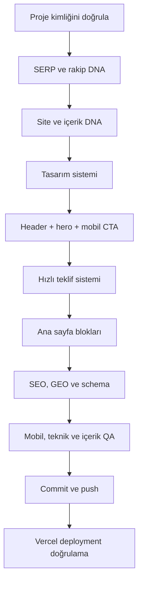

# Mısırlı Turizm — Üretim Akışı

## Her geliştirme öncesi kapı

1. Aktif proje `misirli-turizm` mi?
2. Hedef domain `misirliturizm.com` mu?
3. İstenen özellik kurumsal müşteri kazanım sitesine mi ait?
4. Panel yazılımı veya başka marka verisi yanlışlıkla kapsamda mı?
5. Kullanılan marka ve iletişim verileri doğrulanmış mı?

Bu sorulardan biri belirsizse geliştirme veya yayın işlemi durdurulur.

## Mevcut durum

- [x] Next.js proje kurulumu
- [ ] GitHub repo gizliliği: repo şu an `public`; `private` olarak değiştirilmesi gerekiyor
- [x] Vercel bağlantısı ve ilk preview
- [x] Marka logosunun işlenmesi
- [x] Tasarım tokenları
- [x] Açılır hizmet ve hizmet bölgesi menülerine sahip responsive header
- [x] Üç sahneli, tam ekran ve erişilebilir premium hero slider
- [x] Mobil sabit CTA
- [x] Hızlı teklif ön değerlendirme sistemi
- [x] Ana sayfanın kalan blokları
- [x] Ana sayfa metadata, schema, robots ve sitemap
- [x] Doğrulanmış telefon, WhatsApp ve e-posta bilgilerinin bağlanması
- [x] SEO uyumlu iletişim sayfası
- [x] Hızlı teklif özetinin WhatsApp teslimatına bağlanması
- [x] Pillar / cluster ve iç link mimarisi
- [x] İstanbul kurumsal personel taşımacılığı pillar sayfası
- [x] Vardiyalı personel servisi cluster sayfası
- [x] Fabrika personel taşımacılığı cluster sayfası
- [x] Kurumsal servis güzergâh planlama cluster sayfası
- [x] Personel servisi fiyatları cluster sayfası
- [x] İstanbul hizmet bölgeleri hub sayfası
- [x] İstanbul Avrupa Yakası ayrı SEO bölge sayfası
- [x] İstanbul Anadolu Yakası ayrı SEO bölge sayfası
- [x] İlk ilçe sayfası: Başakşehir–İkitelli personel servisi
- [x] Hizmetlerimiz bağımsız menü ve SEO merkez sayfası
- [x] Kurumsal bağımsız menü ve SEO sayfası
- [x] İletişim sayfasında doğrulanmış Pendik adresi ve harita
- [ ] Kalan ilçe bazlı hizmet bölgesi sayfaları
- [ ] Nihai domain bağlantısı

## Yayın kapısı

- Proje ve domain tekrar doğrulanır.
- `npm run lint` ve `npm run build` geçer.
- Masaüstü ve mobil görünüm kontrol edilir.
- İç linkler ve CTA hedefleri çalışır.
- Metadata, canonical, schema ve indeksleme kararları incelenir.
- Commit açıklayıcıdır; push sonrası Vercel sonucu ve preview URL doğrulanır.
